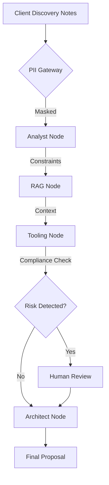
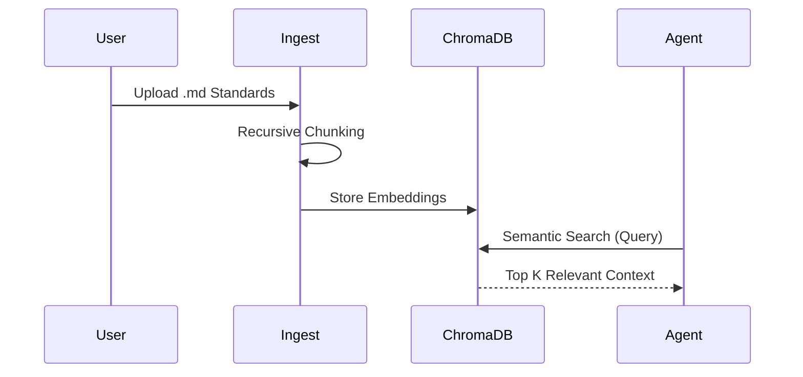
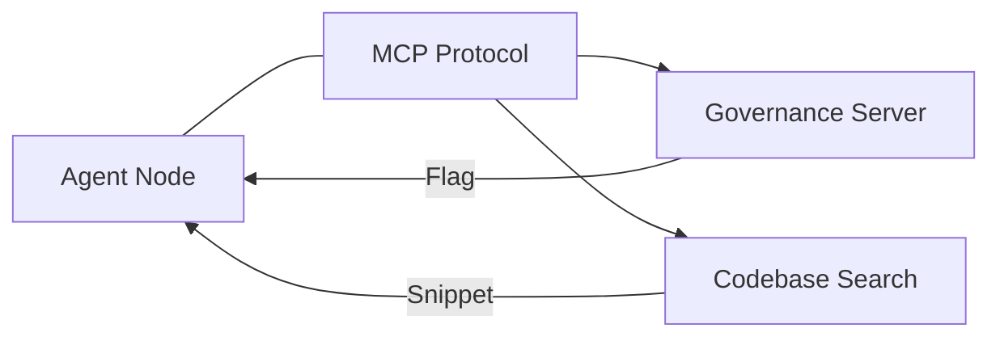
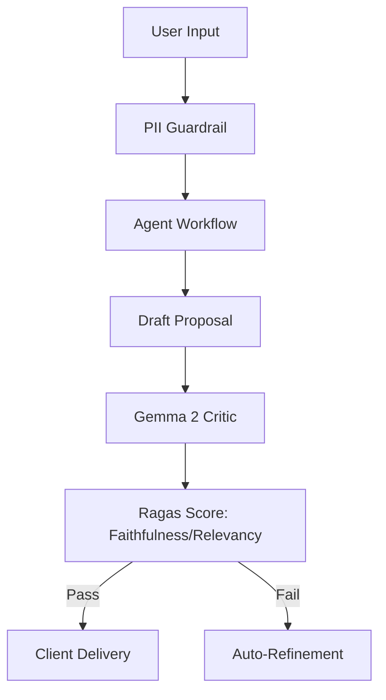
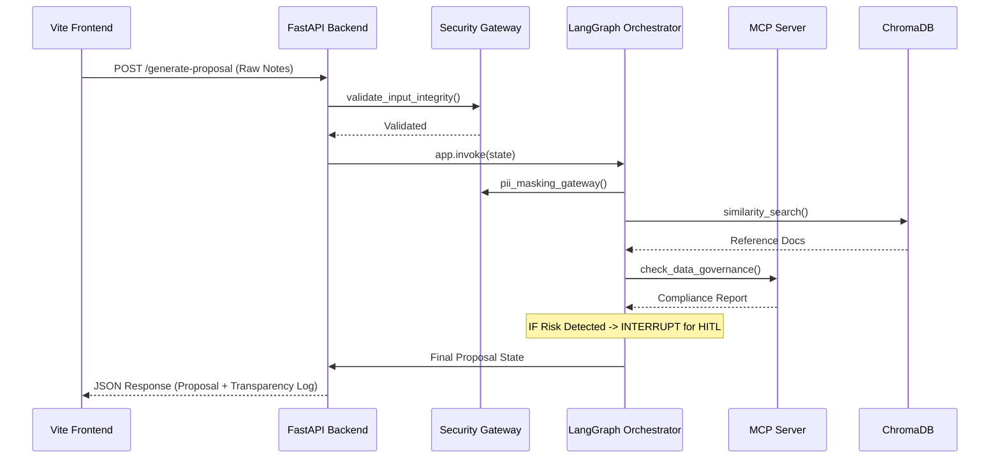
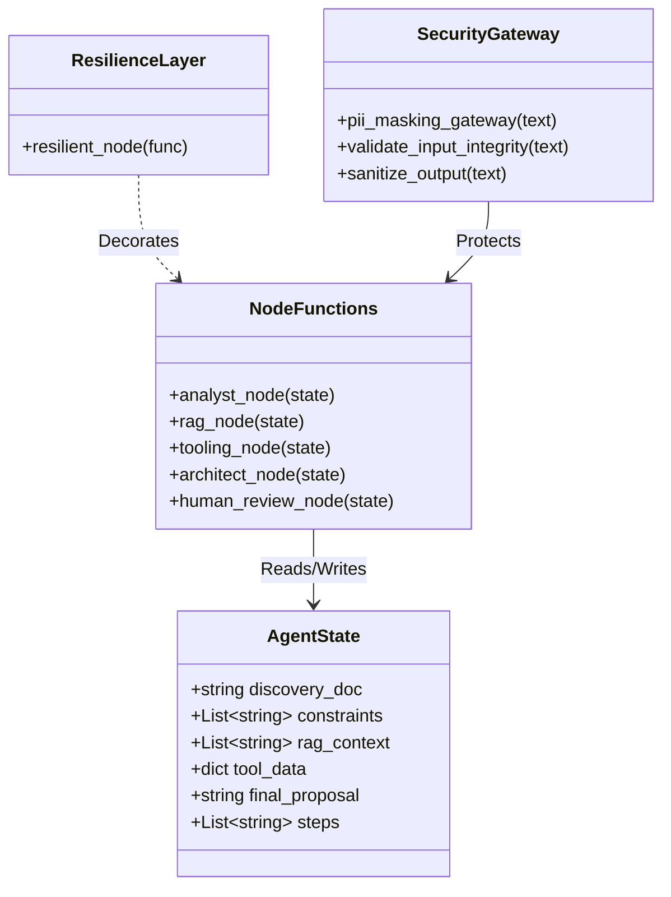
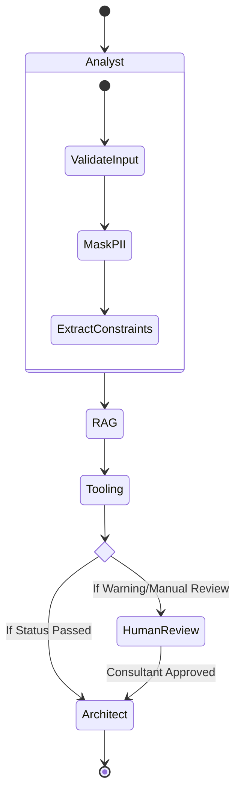
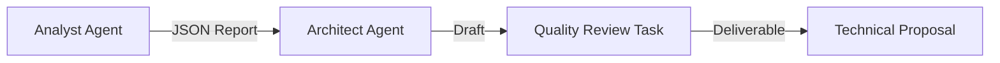
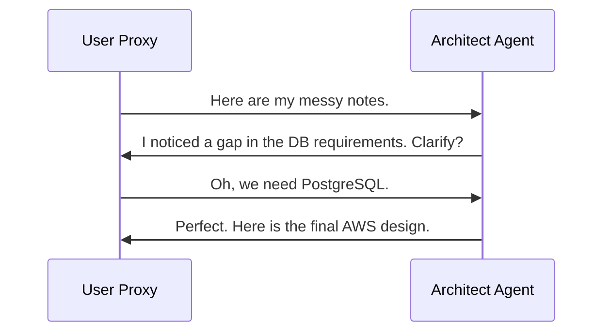

# System Architecture & Technical Deep-Dive

This document provides a visual and technical breakdown of the **Consulting Delivery Copilot**. Our architecture is designed for **high-trust consulting**, prioritizing security, transparency, and scientific evaluation.

---

## 1. System Orchestration (The Brain)

The system is powered by **LangGraph**, a stateful orchestration framework that moves beyond simple prompts to a deterministic state machine.

---

## 2. The RAG Pipeline (Semantic Memory)

We use a **ChromaDB** vector store to ground the agent in "Ground Truth" data, preventing hallucinations.

---

## 3. MCP Tool Integration (Live Connectivity)

The **Model Context Protocol (MCP)** allows our agent to safely interact with external governance rules and local codebases.

---

## 4. Security & Evaluation (The Safety Kernel)

We don't just "hope" the system works; we measure it using **Ragas** and protect it with **Guardrails**.

---

## 5. Detailed Interaction (Sequence Diagram)

This diagram tracks the lifecycle of a single request as it traverses the full-stack ecosystem.

---

## 6. Data Structure (Class Diagram)

The system's core is defined by the `AgentState` and the modular node functions. This diagram visualizes the "Contract" between different parts of the system.

---

## 7. Workflow Lifecycle (State Diagram)

This diagram focuses on the LangGraph transitions and the critical "Human-in-the-Loop" decision point.

---

## 8. Multi-Orchestration Parity

The system is designed with a **Pluggable Engine Architecture**, allowing you to choose the orchestration framework that best fits the client's problem.

| Framework | Paradigm | Best For... |
| :--- | :--- | :--- |
| **LangGraph** | Stateful / Cyclical | High-trust, deterministic enterprise workflows with strict safety kernel. |
| **CrewAI** | Role-Based / Sequential | Collaborative, persona-driven tasks requiring high creativity (e.g., Marketing + Architecture). |
| **AutoGen** | Conversational / P2P | Interactive discovery sessions where the agent must negotiate with a human or another agent. |

### A. CrewAI: Role-Based Workflow
In `backend/engines/crew_engine.py`, we define a **Senior Analyst** and a **Principal Architect** who work as a team.

### B. AutoGen: Conversational Discovery
In `backend/engines/autogen_engine.py`, the agent and the client "negotiate" the architecture through a peer-to-peer chat.

---
*Generated by the Consulting Delivery Copilot Architectural Suite.*
